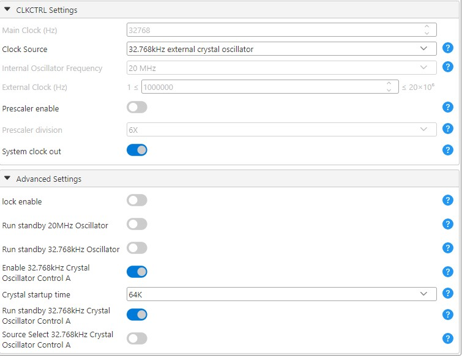
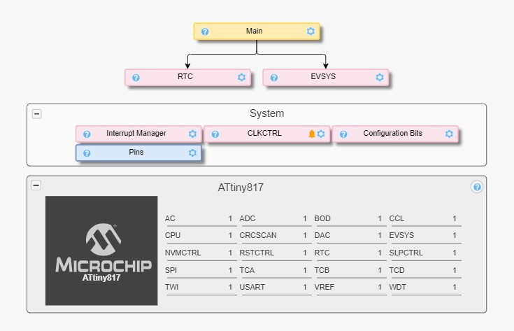
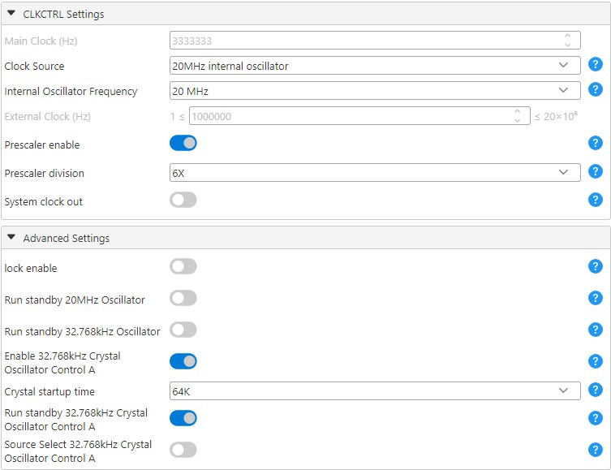
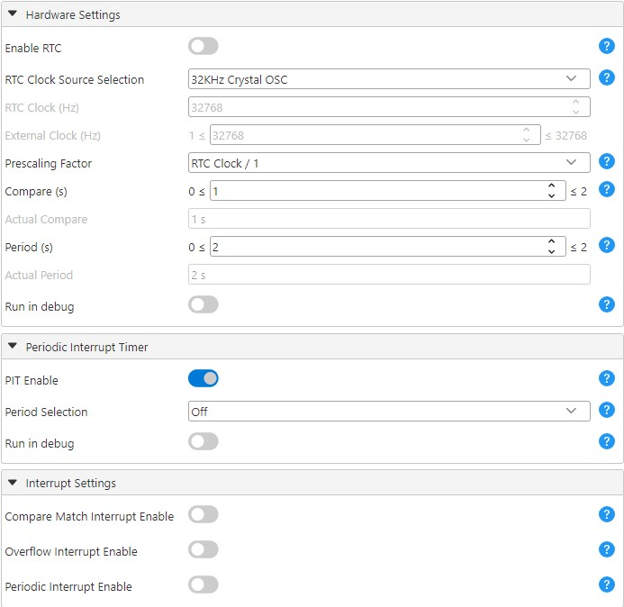
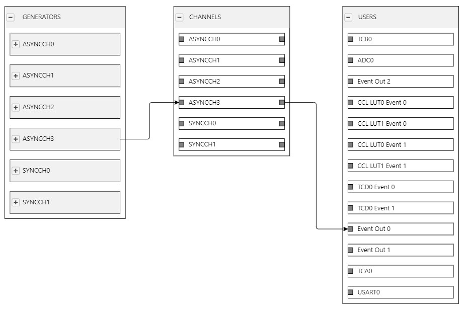

<!-- Please do not change this html logo with link -->

# RTC Crystal Frequency Output

The projects in this repository will output the crystal clock on a pin. Two projects are made available to accomplish this. The xosc-clock-out-system-clock project will change the system clock source to the 32.768 kHz crystal and use the clock out pin (PB5). The xosc-clock-out-evsys-rtc project will output the crystal frequency divided by 64 using the Peripheral Interrupt Timer (PIT) and the Event System on pin PA2, without switching the system clock to 32.768 kHz.

These examples are based on the Application Note [AN2711 - Real-Time Clock Calibration and Compensation on AVR® Microcontrollers](https://www.microchip.com/DS00002711), which should be referred to for a more detailed understanding of the concepts.

## Related Documentation

- [AN2711 - Real-Time Clock Calibration and Compensation on AVR® Microcontrollers](https://www.microchip.com/DS00002711)
- [ATtiny817 Device Page](https://www.microchip.com/wwwproducts/en/ATTINY817)

## Software Used

- [MPLAB® X IDE](http://www.microchip.com/mplab/mplab-x-ide) v6.20 or newer
- [ATtiny DFP](http://packs.download.atmel.com/) v3.1.260 or newer
- [MPLAB® XC8](http://www.microchip.com/mplab/compilers) v2.50 or a newer

## Hardware Used

- [ATtiny817 Xplained Pro](https://www.microchip.com/DevelopmentTools/ProductDetails/attiny817-xpro)
- Micro-USB cable (Type-A/Micro-B)

## Setup

1. The crystal on the ATtiny817 Xplained Pro board is by default not connected to the TOSC pins, as they are used for UART communication. To connect the pins, remove resistors R307 and R308 and place them on the footprints of R312 and R313. Refer to [ATtiny817 Xplained Pro User's Guide](https://www.microchip.com/DS50002684) for more information on how to do this.

## XOSC clock out system clock

This project changes the system clock source to the 32.768 kHz crystal and use the clock out pin (PB5).

### MCC setup

#### CLKCTRL

Change the Clock Source Selection to 32.768kHz external crystal oscillator and disable the Prescaler enable. Enable System clock out, Enable 32.768kHz Crystal Oscillator Control A and Run standby 32.768kHz Crystal Oscillator Control A. Set Crystal startup time to 64K.

## XOSC clock out evsys rtc

This project will output the crystal frequency divided by 64 using the Peripheral Interrupt Timer (PIT) and the Event System on pin PA2, without switching the system clock to 32.768 kHz. With this setup the system clock can be different from the outputed clock.

### MCC setup

An overview of the MCC setup is shown in the image below:

#### CLKCTRL

Enable Enable 32.768kHz Crystal Oscillator Control A and Run standby 32.768kHz Crystal Oscillator Control A. Set Crystal startup time to 64K.

#### RTC

In the RTC peripheral, disable Enable RTC and OverFlow Interrupt Enable as the PIT timer is the only one used and they RTC and PIT timers can be enabled seperately. Set the RTC Clock Source Selection to 32KHz Crystal OSC. Enable PIT Enable.

#### EVSYS

In the EVSYS peripheral connect GENERATORS>ASYNCCH3>PIT_DIV64 to the CHANNELS>ASYNCCH3, then further connect CHANNELS>ASYNCCH3 to USERS>Event Out 0. MCC will then connect that to the PA2 pin as output.

## Operation

1. Connect the board to the PC.

2. Download the zip file or clone the example to get the source code.

3. Open the project in MPLAB X IDE.

4. Build the solution and program the ATtiny817.

## Conclusion

These examples have now illustrated how you can output the crystal clock on a pin.
